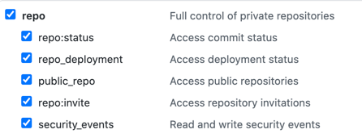

# Github Runner Docker
This creates a Github Runner that runs on your local machine using Docker. 

**UPDATE:** Turns out this isn't possible because [Github Actions disallows it](https://github.com/actions/runner/issues/367#issuecomment-597742895). There's hopes that it'll be fixed soon. Until then, this solution frustratingly doesn't work. One of the more popular repos also has this problem:
```bash
docker run -it --name my-runner \
-e RUNNER_NAME=my-runner \
-e GITHUB_ACCESS_TOKEN=<github-personal-access-token> \
-e RUNNER_REPOSITORY_URL=<github-repo-url> \
-v /var/run/docker.sock:/var/run/docker.sock \
tcardonne/github-runner
```

## Quickstart
1. [Create a Github Personal Access Token](https://docs.github.com/en/github/authenticating-to-github/creating-a-personal-access-token) with the Repo Scope. This will be used to generate a token to register a GithubRunner.
   
2. If your Github Runner will talk to AWS, set up your AWS CLI and authenticate to your AWS account and store those credentials in the `default` profile.
3. Start the runner
    ```bash
    ./go run <github-repo-url> <github username>
    ```
    You will be prompted for your `'host'` password. This is the Github Personal Access Token that you created in (1).
4. Trigger a pipeline in the `<github-repo-url>` and see it connect.

## Development
Build the container locally: `./go build`